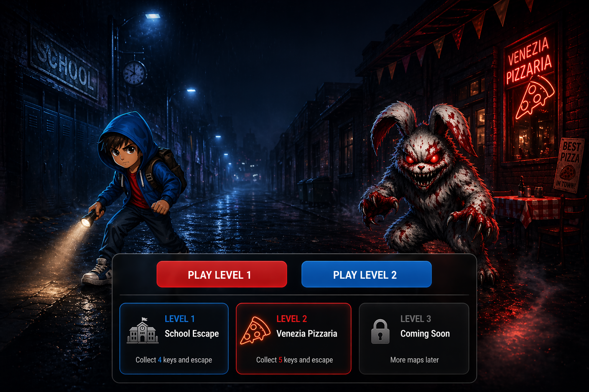

# STILL INSANE

> A horror escape survival game made as a school project by Martin.

---

## PLAY NOW

🎮 https://martindez.github.io/still-insane/

---

## ABOUT THE GAME

Still Insane is a browser-based horror escape game where you must survive and escape while being hunted by a killer.

Collect keys, unlock exits, move carefully, and complete every level before it is too late.

Every move matters.

---

## LEVELS

### Level 1 — School
Escape the school before the killer finds you.

### Level 2 — Pizzaria
Search the dark pizzaria and survive.

### Level 3 — Edderkoppen
The final challenge. Escape Martin's school apartment.

---

## HOW TO PLAY

- Click / Tap connected rooms to move
- Collect all keys in the level
- Unlock the exit
- Reach the exit safely
- Avoid the killer rabbit

---

## RULES

- The killer moves after you move
- If the killer enters your room, you lose
- Collect every key before the exit opens

---

## FEATURES

✅ 3 Unique Maps  
✅ Horror Atmosphere  
✅ Music & Sound Effects  
✅ Mobile Friendly  
✅ Playable in Browser  
✅ Final Survival Ending  

---

## BUILT WITH

- HTML5  
- CSS3  
- JavaScript  
- GitHub Pages  

---

## SCHOOL PROJECT

Created as a school project by **Martin**.

---

## FUTURE IDEAS

- More levels  
- Save system  
- Better AI killer  
- Multiplayer mode  
- Hard mode  

---

## GOOD LUCK

You are not alone.
